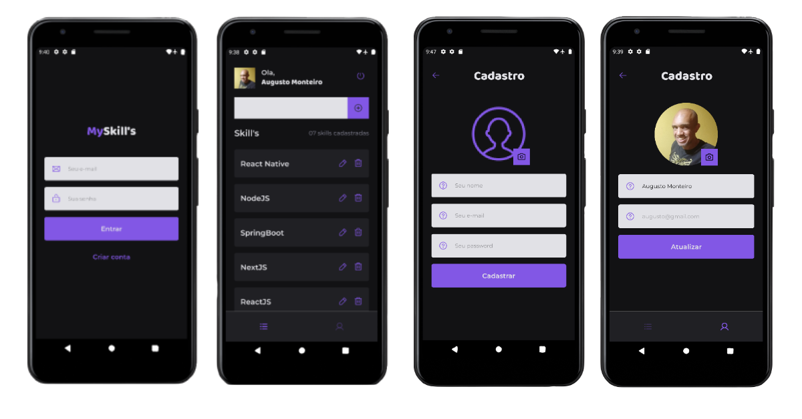

# MySkill

Aplicação criada para testar as habilidades de backend e frontend com foco no estudo de offline first. A API foi criada com express e mobile com react-native.

### Iniciando a aplicação

- Atualizar baseURL em `mobile/src/global/services/api.ts` para o endereço de IP da sua máquina para utilizar o backend.
- Acessar a pasta `server`, digitar os comando `yarn ou npm install` para baixar as dependências, e em seguida `yarn dev`.
- Acessar a pasta `mobile`, digitar os comando `yarn ou npm install` para baixar as dependências, e em seguida `yarn android`

### Rotas da API

Para visualizar exemplos testados de todas as rotas da API, você pode importar no seu Insomnia o arquivo: a./rotas_Insomnia.json

### Stack

- React Native
- Typescript
- Expo Bare Workflow
- WatermelonDB
- Offline first
- Nodejs as backend
- Prisma database ORM
- SQLite database

### Features

- User authentication
- Create new user
- Profile Update
- List cars avaiables
- Create skill
- List skill by user id
- Alterar skill
- Delete skill
- And more...
